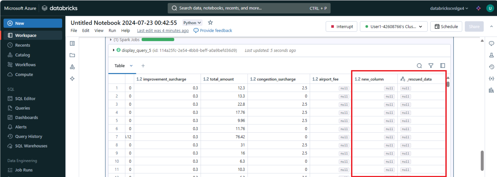

---
lab:
  title: 优化 Azure Databricks 中的数据管道，获得更佳性能
---

# 优化 Azure Databricks 中的数据管道，获得更佳性能

优化 Azure Databricks 中的数据管道可以显著提高性能和效率。 利用自动加载程序进行增量数据引入，加之 Delta Lake 的存储层，可确保可靠性和 ACID 事务。 使用加盐模式可以防止数据倾斜，而 Z 顺序聚类分析通过并置相关信息优化文件读取。 Azure Databricks 的自动优化功能和基于成本的优化器可以通过根据工作负荷要求调整设置来进一步提高性能。

完成本实验室大约需要 30 分钟。

## 预配 Azure Databricks 工作区

> **提示**：如果你已有 Azure Databricks 工作区，则可以跳过此过程并使用现有工作区。

本练习包括一个用于预配新 Azure Databricks 工作区的脚本。 该脚本会尝试在一个区域中创建*高级*层 Azure Databricks 工作区资源，在该区域中，Azure 订阅具有本练习所需计算核心的充足配额；该脚本假设你的用户帐户在订阅中具有足够的权限来创建 Azure Databricks 工作区资源。 如果脚本由于配额或权限不足失败，可以尝试 [在 Azure 门户中以交互方式创建 Azure Databricks 工作区](https://learn.microsoft.com/azure/databricks/getting-started/#--create-an-azure-databricks-workspace)。

1. 在 Web 浏览器中，登录到 [Azure 门户](https://portal.azure.com)，网址为 `https://portal.azure.com`。

2. 使用页面顶部搜索栏右侧的 [\>_] 按钮在 Azure 门户中创建新的 Cloud Shell，在出现提示时选择“PowerShell”环境并创建存储。 Cloud Shell 在 Azure 门户底部的窗格中提供命令行界面，如下所示：

    

    > 注意：如果以前创建了使用 Bash 环境的 Cloud shell，请使用 Cloud Shell 窗格左上角的下拉菜单将其更改为“PowerShell”。

3. 请注意，可以通过拖动窗格顶部的分隔条或使用窗格右上角的 &#8212;、&#9723; 或 X 图标来调整 Cloud Shell 的大小，以最小化、最大化和关闭窗格  。 有关如何使用 Azure Cloud Shell 的详细信息，请参阅 [Azure Cloud Shell 文档](https://docs.microsoft.com/azure/cloud-shell/overview)。

4. 在 PowerShell 窗格中，输入以下命令以克隆此存储库：

     ```powershell
    rm -r mslearn-databricks -f
    git clone https://github.com/MicrosoftLearning/mslearn-databricks
     ```

5. 克隆存储库后，请输入以下命令以运行 **setup.ps1** 脚本，以在可用区域中预配 Azure Databricks 工作区：

     ```powershell
    ./mslearn-databricks/setup.ps1
     ```

6. 如果出现提示，请选择要使用的订阅（仅当有权访问多个 Azure 订阅时才会发生这种情况）。

7. 等待脚本完成 - 这通常需要大约 5 分钟，但在某些情况下可能需要更长的时间。 在等待时，请查看 Azure Databricks 文档中的 [Delta Lake 简介](https://docs.microsoft.com/azure/databricks/delta/delta-intro)一文。

## 创建群集

Azure Databricks 是一个分布式处理平台，可使用 Apache Spark 群集在多个节点上并行处理数据。 每个群集由一个用于协调工作的驱动程序节点和多个用于执行处理任务的工作器节点组成。 在本练习中，将创建一个*单节点*群集，以最大程度地减少实验室环境中使用的计算资源（在实验室环境中，资源可能会受到限制）。 在生产环境中，通常会创建具有多个工作器节点的群集。

> **提示**：如果 Azure Databricks 工作区中已有一个具有 13.3 LTS ML 或更高运行时版本的群集，则可以使用它来完成此练习并跳过此过程。

1. 在 Azure 门户中，浏览到已由脚本创建的 **msl-xxxxxxx*** 资源组（或包含现有 Azure Databricks 工作区的资源组）

1. 选择 Azure Databricks 服务资源（如果已使用安装脚本创建，则名为 **databricks-xxxxxxx***）。

1. 在工作区的“概述”**** 页中，使用“启动工作区”**** 按钮在新的浏览器标签页中打开 Azure Databricks 工作区；请在出现提示时登录。

    > 提示：使用 Databricks 工作区门户时，可能会显示各种提示和通知。 消除这些内容，并按照提供的说明完成本练习中的任务。

1. 在左侧边栏中，选择“**(+) 新建**”任务，然后选择“**群集**”。

1. 在“新建群集”页中，使用以下设置创建新群集：
    - 群集名称：用户名的群集（默认群集名称）
    - **策略**：非受限
    - 群集模式：单节点
    - 访问模式：单用户（选择你的用户帐户）
    - **Databricks 运行时版本**：13.3 LTS（Spark 3.4.1、Scala 2.12）或更高版本
    - 使用 Photon 加速：已选择
    - 节点类型：Standard_DS3_v2
    - 在处于不活动状态 20 分钟后终止**********

1. 等待群集创建完成。 这可能需要一到两分钟时间。

    > 注意：如果群集无法启动，则订阅在预配 Azure Databricks 工作区的区域中的配额可能不足。 请参阅 [CPU 内核限制阻止创建群集](https://docs.microsoft.com/azure/databricks/kb/clusters/azure-core-limit)，了解详细信息。 如果发生这种情况，可以尝试删除工作区，并在其他区域创建新工作区。 可以将区域指定为设置脚本的参数，如下所示：`./mslearn-databricks/setup.ps1 eastus`

## 创建笔记本并引入数据

1. 在边栏中，使用“(+) 新建”**** 链接创建**笔记本**。 在“连接”**** 下拉列表中，选择群集（如果尚未选择）。 如果群集未运行，可能需要一分钟左右才能启动。

2. 在笔记本的第一个单元格中输入以下代码，该代码使用 *shell* 命令将数据文件从 GitHub 下载到群集使用的文件系统中。

     ```python
    %sh
    rm -r /dbfs/nyc_taxi_trips
    mkdir /dbfs/nyc_taxi_trips
    wget -O /dbfs/nyc_taxi_trips/yellow_tripdata_2021-01.parquet https://github.com/MicrosoftLearning/mslearn-databricks/raw/main/data/yellow_tripdata_2021-01.parquet
     ```

3. 在新单元格中，输入以下代码，将数据集加载到数据帧中：
   
     ```python
    # Load the dataset into a DataFrame
    df = spark.read.parquet("/nyc_taxi_trips/yellow_tripdata_2021-01.parquet")
    display(df)
     ```

4. 使用单元格左侧的“&#9656; 运行单元格”菜单选项来运行该代码****。 然后等待代码运行的 Spark 作业完成。

## 使用自动加载程序优化数据引入：

优化数据引入对于高效处理大型数据集至关重要。 自动加载程序旨在数据文件存储到云时处理它们，可以支持各种文件格式和云存储服务。 

自动加载程序提供了名为 `cloudFiles` 的结构化流式处理源。 给定云文件存储上的输入目录路径后，`cloudFiles` 源将在新文件到达时自动处理这些文件，你也可以选择处理该目录中的现有文件。 

1. 在新单元格中，运行以下代码，基于包示例数据的文件夹创建流：

     ```python
     df = (spark.readStream
             .format("cloudFiles")
             .option("cloudFiles.format", "parquet")
             .option("cloudFiles.schemaLocation", "/stream_data/nyc_taxi_trips/schema")
             .load("/nyc_taxi_trips/"))
     df.writeStream.format("delta") \
         .option("checkpointLocation", "/stream_data/nyc_taxi_trips/checkpoints") \
         .option("mergeSchema", "true") \
         .start("/delta/nyc_taxi_trips")
     display(df)
     ```

2. 在新单元格中，运行以下代码，将新的 Parquet 文件添加到流中：

     ```python
    %sh
    rm -r /dbfs/nyc_taxi_trips
    mkdir /dbfs/nyc_taxi_trips
    wget -O /dbfs/nyc_taxi_trips/yellow_tripdata_2021-02_edited.parquet https://github.com/MicrosoftLearning/mslearn-databricks/raw/main/data/yellow_tripdata_2021-02_edited.parquet
     ```
   
新文件新增一列，因此流会停止并出现 `UnknownFieldException` 错误。 在流引发此错误之前，自动加载程序会在最新的数据微批上执行架构推理，并通过将新列合并到架构末尾来使用最新架构更新架构位置。 现有列的数据类型将保持不变。

3. 再次运行流式处理代码单元，并验证是否已将两个新列添加到表中：

   
   
> 注意：`_rescued_data` 列包含因类型不匹配、大小写不匹配或架构中缺少列而未分析的任何数据。

4. 选择“中断”**** 以停止数据流式处理。
   
以 Delta 表形式写入流式处理数据。 Delta Lake 为传统 Parquet 文件提供了一系列增强功能，包括 ACID 事务、架构演变、按时间顺序查看以及统一流式数据处理和批量数据处理，使其成为管理大数据工作的强大解决方案。

## 数据转换优化

在分布式计算中，数据倾斜是一个重大挑战，尤其是在使用 Apache Spark 等框架的大数据处理中。 加盐是一种有效的技术，可通过在分区前向键添加随机组件或“加盐”来优化数据倾斜。 此过程有助于在分区之间更均匀地分配数据，从而使工作负荷更均衡并提高性能。

1. 在新单元格中，运行以下代码，将含有随机整数的*加盐*列附加到较小的分区中，从而将大型倾斜分区分解为较小的分区：

     ```python
    from pyspark.sql.functions import lit, rand

    # Convert streaming DataFrame back to batch DataFrame
    df = spark.read.parquet("/nyc_taxi_trips/*.parquet")
     
    # Add a salt column
    df_salted = df.withColumn("salt", (rand() * 100).cast("int"))

    # Repartition based on the salted column
    df_salted.repartition("salt").write.format("delta").mode("overwrite").save("/delta/nyc_taxi_trips_salted")

    display(df_salted)
     ```   

## 优化存储

Delta Lake 提供了一套优化命令，可以显著提高数据存储的性能和管理。 `optimize` 命令旨在通过压缩和 Z 排序等技术更有效地组织数据，从而提高查询速度。

压缩会将较小的文件合并为较大的文件，这对于读取查询尤其有利。 Z 排序涉及排列数据点，以便将相关信息存储在一起，从而减少在查询期间访问此数据所需的时间。

1. 在新单元格中，运行以下代码，对增量表执行压缩：

     ```python
    from delta.tables import DeltaTable

    delta_table = DeltaTable.forPath(spark, "/delta/nyc_taxi_trips")
    delta_table.optimize().executeCompaction()
     ```

2. 在新单元格中，运行以下代码，进行 Z 顺序聚类分析：

     ```python
    delta_table.optimize().executeZOrderBy("tpep_pickup_datetime")
     ```

此方法将在同一组文件中共同查找相关信息，从而提高查询性能。

## 清理

在 Azure Databricks 门户的“**计算**”页上，选择群集，然后选择“**&#9632; 终止**”以将其关闭。

如果已完成对 Azure Databricks 的探索，则可以删除已创建的资源，以避免产生不必要的 Azure 成本并释放订阅中的容量。
