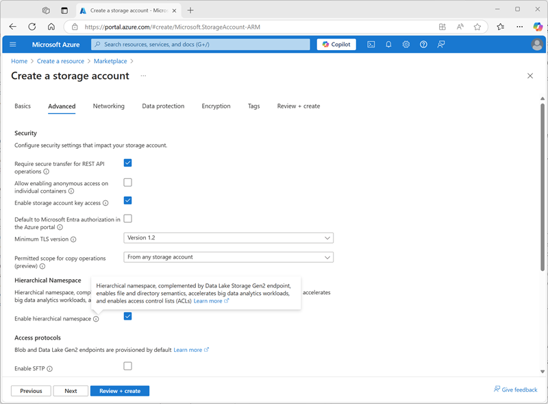
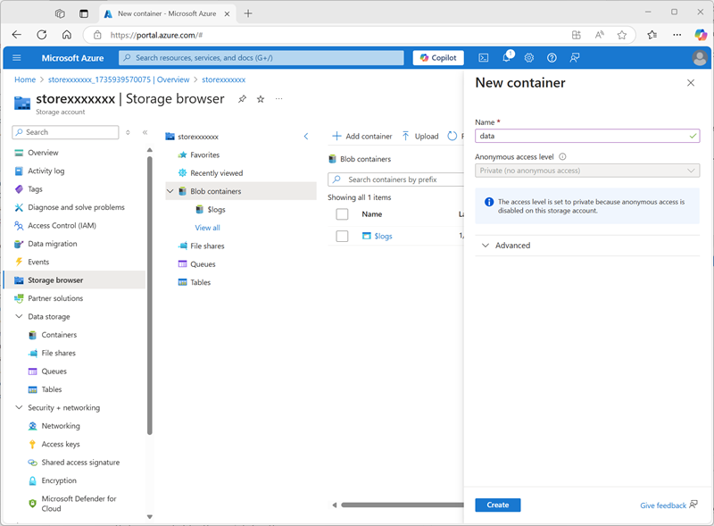
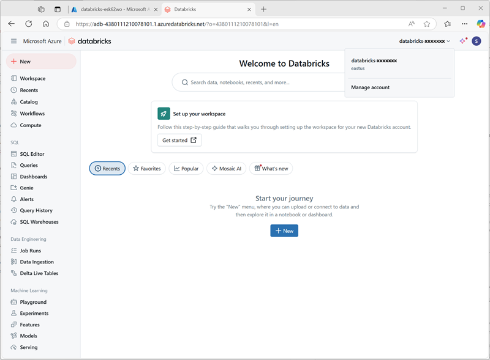

---
lab:
  title: 探索 Azure Databricks 中的 Unity Catalog
---

# 探索 Azure Databricks 中的 Unity Catalog

Unity Catalog 为数据和 AI 提供集中管理解决方案，通过提供单一的管理和审核数据访问的环境来简化安全性。 在本练习中，你将为 Azure Databricks 工作区配置 Unity Catalog，并使用它来管理数据。

> **备注**：在某些情况下，可能已为工作区启用 Unity Catalog。 你仍可以按照本练习中的步骤为目录分配新的存储帐户。

完成本实验室大约需要 45 分钟。

> **备注**：Azure Databricks 用户界面可能会不断改进。 自编写本练习中的说明以来，用户界面可能已更改。

## 开始之前

你需要一个在其中具有<u>全局管理员</u>权限的 [zure 订阅](https://azure.microsoft.com/free)。

> **重要说明**：本练习假定你在 Azure 订阅中拥有*全局管理员*权限。 要在 Azure Databricks 工作区中启用 Unity Catalog，将需要此级别的访问权限来管理 Databricks 帐户。

## 创建 Azure Databricks 工作区

> **提示**：如果你已拥有高级层 Azure Databricks 工作区，则可以跳过此过程并使用现有工作区。

1. 登录到 Azure 门户，地址为 ****。
2. 请使用以下设置创建 **Azure Databricks** 资源：
    - 订阅****：*选择 Azure 订阅*
    - **资源组**：*创建名为 `msl-xxxxxxx`（其中“xxxxxxx”是唯一值）的新资源组*
    - **工作区名称**：`databricks-xxxxxxx`*（其中“xxxxxxx”是资源组名称中使用的值）*
    - **区域**：*选择任何可用区域*
    - **定价层**：*高级*或*试用版*
    - **受管理资源组名称**：`databricks-xxxxxxx-managed`*（其中“xxxxxxx”是资源组名称中使用的值）*

    

3. 选择“**查看 + 创建**”，然后等待部署完成。

## 为目录准备存储

在 Azure Databricks 中使用 Unity Catalog 时，数据存储在外部存储中，且可在多个工作区之间共享。 在 Azure 中，通常使用支持 Azure Data Lake Storage Gen2 分层命名空间的 Azure 存储帐户，以实现此目的。

1. 在 Azure 门户中，使用以下设置创建新的**存储帐户**资源：
    - 基本信息：
        - 订阅****：*选择 Azure 订阅*
        - **资源组**：*选择在其中创建了 Azure Databricks 工作区的现有 **msl-xxxxxxx** 资源组。*
        - **存储帐户名称**：`storexxxxxxx`*（其中“xxxxxxx”是资源组名称中使用的值）*
        - **区域**：*选择 <u>在其中创建了 Azure Databricks 工作区的区域</u>*
        - **主服务**：Azure Blob 存储或 Azure Data Lake Storage Gen 2
        - **性能**：标准
        - **冗余**：本地冗余存储 (LRS)*（对于类似本练习的非生产解决方案，此选项成本更低，且具有容量消耗优势）*
    - 高级：****
        - **启用分层命名空间**：*已选*。
    
    

1. 选择“**查看 + 创建**”，然后等待部署完成。
1. 部署完成后，转至已部署的 *storexxxxxxx* 存储帐户资源，并使用其“**存储浏览器**”页添加名为 `data` 的新 Blob 容器。 这是将存储 Unity Catalog 对象数据的位置。

    

## 配置对目录存储的访问权限

要访问为 Unity Catalog 创建的 Blob 容器，Azure Databricks 工作区必须使用托管帐户，通过*访问连接器*连接到存储帐户。

1. 在 Azure 门户中，创建新的 **Azure Databricks 访问连接器**资源，并指定以下设置：
    - 订阅****：*选择 Azure 订阅*
    - **资源组**：*选择在其中创建了 Azure Databricks 工作区的现有 **msl-xxxxxxx** 资源组。*
    - **名称**：`connector-xxxxxxx`*（其中“xxxxxxx”是资源组名称中使用的值）*
    - **区域**：*选择 <u>在其中创建了 Azure Databricks 工作区的区域</u>*

    

1. 选择“**查看 + 创建**”，然后等待部署完成。 然后转到已部署的资源，在其“**概述**”页上，记下“**资源 ID**”，该 ID 的格式应为 */subscriptions/abc-123.../resourceGroups/msl-xxxxxxx/providers/Microsoft.Databricks/accessConnectors/connector-xxxxxxx* - 稍后需要用到此 ID。
1. 在 Azure 门户中，返回到 *storexxxxxxx* 存储帐户资源，然后在其“**访问控制 (IAM)**”页上添加新的角色分配。
1. 在“**工作职能角色**”列表中，搜索并选择 `Storage blob data contributor` 角色。

    

1. 选择**下一步**。 然后，在“**成员**”页上，选择用于向**托管标识**分配访问权限的选项，然后查找并选择之前创建的 Azure Databricks 的 `connector-xxxxxxx` 访问连接器（可以忽略在订阅中创建的任何其他访问连接器）

    

1. 查看并分配角色成员身份，以将用于 Azure Databricks 的 *connector-xxxxxxx* 访问连接器的托管标识添加到 *storexxxxxxx* 存储帐户的存储 Blob 数据参与者角色 - 使其能够访问存储帐户中的数据。

## 配置 Unity Catalog

现在，你已为目录创建了 Blob 存储容器，并为 Azure Databricks 托管标识提供了访问该容器的方法，接下来可以将 Unity Catalog 配置为使用基于存储帐户的元存储。

1. 在Azure 门户中，查看 **msl-*xxxxxxx*** 资源组，该资源组现在应包含三个资源：
    - **databricks-*xxxxxxx*** Azure Databricks 工作区
    - **store*xxxxxxx*** 存储帐户
    - Azure Databricks 的 **connector-*xxxxxxx*** 访问连接器

1. 打开之前创建的 **databricks-xxxxxxx** Azure Databricks 工作区资源，然后在其“**概述**”页中，使用“**启动工作区**”按钮在新的浏览器标签页中打开 Azure Databricks 工作区；并在出现提示时进行登录。
1. 在右上角的 **databricks-*xxxxxxx*** 菜单中，选择“**管理帐户**”以在另一个标签页中打开 Azure Databricks 帐户控制台。

    

    > **备注**：如果未列出或未成功打开“***管理帐户***”，可能需要让全局管理员将你的帐户添加到 Azure Databricks 工作区中的***帐户管理员***角色。
    >
    > 如果使用的是通过个人 Microsoft 帐户（例如 oultook.com 帐户）创建的个人 Azure 订阅，则可能已在 Azure 目录中自动创建“外部”Entra ID 帐户，并且可能需要使用该帐户名称登录。
    >
    > 请参阅***[此问题解答会话](https://learn.microsoft.com/answers/questions/2133569/not-able-to-access-databricks-manage-account-conso)*** 以获取帮助。

1. 在 Azure Databricks 帐户控制台的“**目录**”页上，选择“**创建元存储**”。
1. 使用以下设置创建新的元存储：
    - **名称**：`metastore-xxxxxxx`*（其中 xxxxxxx 是本练习中用于资源的唯一值）*
    - **区域**：*选择在其中创建 Azure 资源的区域*
    - **ADLS Gen 2 路径**：`data@storexxxxxxx.dfs.core.windows.net/`*（其中 storexxxxxx 是你的存储帐户名称）*
    - **访问连接器 ID**：*访问连接器的资源 ID（从Azure 门户中的“概述”页复制）*

    

1. 创建元存储后，选择 **databricks-*xxxxxxx*** 工作区并向其分配元存储。

    

## 在 Unity Catalog 中处理数据

分配了永久元存储并启用了 Unity Catalog 后，你可以使用它来处理 Azure Databricks 中的数据。

### 创建和加载表

1. 关闭 Azure Databricks 帐户控制台浏览器标签页，并返回到 Azure Databricks 工作区的标签页。 然后<u>刷新浏览器</u>。
1. 在“**目录**”页上，选择组织的“**主**”目录，并注意已在目录中创建名为“**default**”和“**Information_schema**”的架构。

    

1. 选择“**创建架构**”并创建名为 `sales` 的新架构（将存储位置保留为未指定，以便使用目录的默认元存储）。
1. 在新的浏览器标签页中，将 [**products.csv**](https://raw.githubusercontent.com/MicrosoftLearning/mslearn-databricks/main/data/products.csv) 文件从 `https://raw.githubusercontent.com/MicrosoftLearning/mslearn-databricks/main/data/products.csv` 下载到本地计算机，并将其另存为 **products.csv**。
1. 在 Azure Databricks 工作区的目录资源管理器中，在已选择“**sales**”架构的情况下，选择“**创建** > **创建表**”。 然后上传下载的 **products.csv** 文件，以在“**sales**”架构中创建名为“**products**”的新表。

    > **备注**：可能需要等待几分钟才能启动无服务器计算。

    

1. 创建  表。 如果建议使用 AI 生成的说明，请接受。

### 管理权限

1. 选中“**products**”表后，在“**权限**”选项卡上，验证默认情况下没有为新表分配任何权限（由于你拥有完全管理权限，可以访问该表，但其他任何用户无法查询该表）。
1. 选择“**授权**”，然后配置对表的访问权限，如下所示：
    - **主体**：所有帐户用户
    - **特权**：SELECT
    - **访问所需的其他特权**：另外授予 main.sales 上的 USE SCHEMA 特权

    

### 跟踪世系

1. 在“**+ 新建**”菜单上，选择“**查询**”，并使用以下 SQL 代码新建查询：

    ```sql
    SELECT Category, COUNT(*) AS Number_of_Products
    FROM main.sales.products
    GROUP BY Category; 
    ```

1. 确保无服务器计算已连接，并运行查询以查看结果。

    

1. 将查询另存为 Azure Databricks 用户帐户的工作区文件夹中的 `Products by Category`。
1. 返回到“**目录**”页。 然后展开“**主**”目录和“**sales**”架构，选择“**products**”表。
1. 在“**世系**”标签页上，选择“**查询**”以验证从你创建的查询到源表的世系是否已由 Unity Catalog 进行跟踪。

    

## 清理

在本练习中，你已为 Azure Databricks 工作区启用和配置了 Unity Catalog，并使用它来处理元存储中的数据。 要详细了解在 Azure Databricks 中可使用 Unity Catalog 执行哪些操作，请参阅[使用 Unity Catalog 进行数据管理](https://learn.microsoft.com/azure/databricks/data-governance/)。

如果已完成对 Azure Databricks 的探索，则可以删除已创建的资源，以避免产生不必要的 Azure 成本并释放订阅中的容量。
