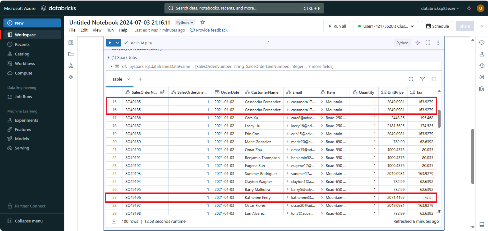

---
lab:
  title: 在 Azure Databricks 中使用 Apache Spark 转换数据
---

# 在 Azure Databricks 中使用 Apache Spark 转换数据

Azure Databricks 是基于 Microsoft Azure 的常用开源 Databricks 平台的一个版本。 

Azure Databricks 基于 Apache Spark 构建，为涉及处理文件中数据的数据工程和分析任务提供了高度可缩放的解决方案。

Azure Databricks 中的常见数据转换任务包括数据清理、执行聚合和类型转换。 这些转换对于准备数据进行分析至关重要，并且是较大的 ETL（提取、转换、加载）流程的一部分。

完成此练习大约需要 30 分钟。

## 预配 Azure Databricks 工作区

> **提示**：如果你已有 Azure Databricks 工作区，则可以跳过此过程并使用现有工作区。

本练习包括一个用于预配新 Azure Databricks 工作区的脚本。 该脚本会尝试在一个区域中创建*高级*层 Azure Databricks 工作区资源，在该区域中，Azure 订阅具有本练习所需计算核心的充足配额；该脚本假设你的用户帐户在订阅中具有足够的权限来创建 Azure Databricks 工作区资源。 如果脚本由于配额或权限不足失败，可以尝试 [在 Azure 门户中以交互方式创建 Azure Databricks 工作区](https://learn.microsoft.com/azure/databricks/getting-started/#--create-an-azure-databricks-workspace)。

1. 在 Web 浏览器中，登录到 [Azure 门户](https://portal.azure.com)，网址为 `https://portal.azure.com`。
2. 使用页面顶部搜索栏右侧的 [\>_] 按钮在 Azure 门户中创建新的 Cloud Shell，在出现提示时选择“PowerShell”环境并创建存储。 Cloud Shell 在 Azure 门户底部的窗格中提供命令行界面，如下所示：

    

    > 注意：如果以前创建了使用 Bash 环境的 Cloud shell，请使用 Cloud Shell 窗格左上角的下拉菜单将其更改为“PowerShell”。

3. 请注意，可以通过拖动窗格顶部的分隔条或使用窗格右上角的 &#8212;、&#9723; 或 X 图标来调整 Cloud Shell 的大小，以最小化、最大化和关闭窗格  。 有关如何使用 Azure Cloud Shell 的详细信息，请参阅 [Azure Cloud Shell 文档](https://docs.microsoft.com/azure/cloud-shell/overview)。

4. 在 PowerShell 窗格中，输入以下命令以克隆此存储库：

    ```
    rm -r mslearn-databricks -f
    git clone https://github.com/MicrosoftLearning/mslearn-databricks
    ```

5. 克隆存储库后，请输入以下命令以运行 **setup.ps1** 脚本，以在可用区域中预配 Azure Databricks 工作区：

    ```
    ./mslearn-databricks/setup.ps1
    ```

6. 如果出现提示，请选择要使用的订阅（仅当有权访问多个 Azure 订阅时才会发生这种情况）。
7. 等待脚本完成 - 这通常需要大约 5 分钟，但在某些情况下可能需要更长的时间。 在等待时，请查看 Azure Databricks 文档中的 [Azure Databricks 上的探索式数据分析](https://learn.microsoft.com/azure/databricks/exploratory-data-analysis/)一文。

## 创建群集

Azure Databricks 是一个分布式处理平台，可使用 Apache Spark 群集在多个节点上并行处理数据。 每个群集由一个用于协调工作的驱动程序节点和多个用于执行处理任务的工作器节点组成。 在本练习中，将创建一个*单节点*群集，以最大程度地减少实验室环境中使用的计算资源（在实验室环境中，资源可能会受到限制）。 在生产环境中，通常会创建具有多个工作器节点的群集。

> **提示**：如果 Azure Databricks 工作区中已有一个具有 13.3 LTS ML 或更高运行时版本的群集，则可以使用它来完成此练习并跳过此过程。

1. 在 Azure 门户中，浏览到已由脚本创建的 **msl-xxxxxxx*** 资源组（或包含现有 Azure Databricks 工作区的资源组）
2. 选择 Azure Databricks 服务资源（如果已使用安装脚本创建，则名为 **databricks-xxxxxxx***）。
3. 在工作区的“概述”**** 页中，使用“启动工作区”**** 按钮在新的浏览器标签页中打开 Azure Databricks 工作区；请在出现提示时登录。

    > 提示：使用 Databricks 工作区门户时，可能会显示各种提示和通知。 消除这些内容，并按照提供的说明完成本练习中的任务。

4. 在左侧边栏中，选择“**(+) 新建**”任务，然后选择“**群集**”。
5. 在“新建群集”页中，使用以下设置创建新群集：
    - 群集名称：用户名的群集（默认群集名称）
    - **策略**：非受限
    - 群集模式：单节点
    - 访问模式：单用户（选择你的用户帐户）
    - **Databricks 运行时版本**：13.3 LTS（Spark 3.4.1、Scala 2.12）或更高版本
    - 使用 Photon 加速：已选择
    - 节点类型：Standard_DS3_v2
    - 在处于不活动状态 20 分钟后终止**********

6. 等待群集创建完成。 这可能需要一到两分钟时间。

> 注意：如果群集无法启动，则订阅在预配 Azure Databricks 工作区的区域中的配额可能不足。 请参阅 [CPU 内核限制阻止创建群集](https://docs.microsoft.com/azure/databricks/kb/clusters/azure-core-limit)，了解详细信息。 如果发生这种情况，可以尝试删除工作区，并在其他区域创建新工作区。 可以将区域指定为设置脚本的参数，如下所示：`./mslearn-databricks/setup.ps1 eastus`

## 创建笔记本

1. 在边栏中，使用“(+) 新建”**** 链接创建**笔记本**。

2. 将默认笔记本名称（**无标题笔记本*[日期]***）更改为**使用 Spark 转换数据**，然后在**连接**下拉列表中选择群集（如果尚未选择）。 如果群集未运行，可能需要一分钟左右才能启动。

## 引入数据

1. 在笔记本的第一个单元格中输入以下代码，该代码使用 shell 命令将数据文件从 GitHub 下载到群集使用的文件系统中。**

     ```python
    %sh
    rm -r /dbfs/spark_lab
    mkdir /dbfs/spark_lab
    wget -O /dbfs/spark_lab/2019.csv https://raw.githubusercontent.com/MicrosoftLearning/mslearn-databricks/main/data/2019_edited.csv
    wget -O /dbfs/spark_lab/2020.csv https://raw.githubusercontent.com/MicrosoftLearning/mslearn-databricks/main/data/2020_edited.csv
    wget -O /dbfs/spark_lab/2021.csv https://raw.githubusercontent.com/MicrosoftLearning/mslearn-databricks/main/data/2021_edited.csv
     ```

2. 使用单元格左侧的“&#9656; 运行单元格”菜单选项来运行该代码****。 然后等待代码运行的 Spark 作业完成。
3. 添加新的代码单元，并使用它来运行以下代码，这会定义数据的架构：

    ```python
   from pyspark.sql.types import *
   from pyspark.sql.functions import *
   orderSchema = StructType([
        StructField("SalesOrderNumber", StringType()),
        StructField("SalesOrderLineNumber", IntegerType()),
        StructField("OrderDate", DateType()),
        StructField("CustomerName", StringType()),
        StructField("Email", StringType()),
        StructField("Item", StringType()),
        StructField("Quantity", IntegerType()),
        StructField("UnitPrice", FloatType()),
        StructField("Tax", FloatType())
   ])
   df = spark.read.load('/spark_lab/*.csv', format='csv', schema=orderSchema)
   display(df.limit(100))
    ```

## 清理数据

请注意，此数据集在“税款”**** 列中具有一些重复的行和 `null` 值。 因此，在进一步处理和分析数据之前，需要执行清理步骤。



1. 在现有代码单元格下，使用 + 图标添加新的代码单元格****。 然后在新单元格中输入并运行以下代码，以删除表中的重复行，并将 `null` 条目替换为正确的值：

    ```python
    from pyspark.sql.functions import col
    df = df.dropDuplicates()
    df = df.withColumn('Tax', col('UnitPrice') * 0.08)
    df = df.withColumn('Tax', col('Tax').cast("float"))
    ```

请注意，更新“税款”**** 列中的值后，其数据类型将再次设置为 `float`。 这是因为其数据类型在执行计算后更改为 `double`。 由于 `double` 内存使用量高于 `float`，因此为了提高性能，最好将列类型转换回 `float`。

## 筛选数据帧

1. 添加新的代码单元，并使用它运行以下代码，这将：
    - 筛选销售订单数据帧的列，以仅包含客户名称和电子邮件地址。
    - 统计订单记录总数
    - 计算不同客户的数量
    - 显示不同的客户

    ```python
   customers = df['CustomerName', 'Email']
   print(customers.count())
   print(customers.distinct().count())
   display(customers.distinct())
    ```

    观察以下详细信息：

    - 对数据帧执行操作时，结果是一个新数据帧（在本例中，是一个新客户数据帧，它是通过从 df 数据帧中选择特定的列子集来创建的）
    - 数据帧提供 count 和 distinct 等函数，可用于汇总和筛选它们包含的数据 。
    - `dataframe['Field1', 'Field2', ...]` 语法是用于定义列子集的快速方法。 还可以使用 select 方法，所以上述代码的第一行可以编写为 `customers = df.select("CustomerName", "Email")`

1. 现在，我们来通过在新的代码单元格中运行以下代码，以应用一个筛选器来仅包括已订购特定产品的客户：

    ```python
   customers = df.select("CustomerName", "Email").where(df['Item']=='Road-250 Red, 52')
   print(customers.count())
   print(customers.distinct().count())
   display(customers.distinct())
    ```

    请注意，你可以将多个函数“链接”到一起，以便一个函数的输出可以成为下一个函数的输入；在这种情况下，由所选方法创建的数据帧是用于应用筛选条件的 where 方法的源数据帧。

## 在数据帧中对数据进行聚合和分组

1. 在新代码单元格中运行以下代码以聚合和分组订单数据：

    ```python
   productSales = df.select("Item", "Quantity").groupBy("Item").sum()
   display(productSales)
    ```

    请注意，结果会显示按产品分组的订单数量之和。 groupBy 方法按“项”对行进行分组，随后将 sum 聚合函数应用于所有剩余的数值列（在本例中为“数量”）

1. 在新代码单元格中，我们来尝试另一个聚合：

    ```python
   yearlySales = df.select(year("OrderDate").alias("Year")).groupBy("Year").count().orderBy("Year")
   display(yearlySales)
    ```

    这一次，结果将显示每年的销售订单数。 请注意，所选方法包括一个 SQL **year** 函数，可用于提取 *OrderDate* 字段的年份组件，然后使用 **alias** 方法为提取的年份值分配一个列名称。 然后，按派生的“*年份*”列对数据进行分组，并计算每个组中的**行**计数，最后使用 **orderBy** 方法对生成的数据帧进行排序。

> **注意**：要详细了解如何在 Azure Databricks 中使用数据帧，请参阅 Azure Databricks 文档中的[数据帧简介 - Python](https://docs.microsoft.com/azure/databricks/spark/latest/dataframes-datasets/introduction-to-dataframes-python)。

## 在单元格中运行 SQL

1. 虽然能够将 SQL 语句嵌入到包含 PySpark 代码的单元格中非常有用，但数据分析师通常只想要直接在 SQL 中工作。 添加一个新代码单元格并使用它运行以下代码。

    ```sql
   %sql
    
   SELECT YEAR(OrderDate) AS OrderYear,
          SUM((UnitPrice * Quantity) + Tax) AS GrossRevenue
   FROM salesorders
   GROUP BY YEAR(OrderDate)
   ORDER BY OrderYear;
    ```

    观察以下情况：
    
    - 单元格开头的 ``%sql` 行（名为 magic）指示应使用 Spark SQL 语言运行时来运行此单元格中的代码，而不是 PySpark。
    - SQL 代码会引用之前创建的 **salesorder** 视图。
    - SQL 查询的输出将自动显示为单元格下的结果。
    
> 注意：有关 Spark SQL 和数据帧的详细信息，请参阅 [Spark SQL 文档](https://spark.apache.org/docs/2.2.0/sql-programming-guide.html)。

## 清理

在 Azure Databricks 门户的“**计算**”页上，选择群集，然后选择“**&#9632; 终止**”以将其关闭。

如果已完成对 Azure Databricks 的探索，则可以删除已创建的资源，以避免产生不必要的 Azure 成本并释放订阅中的容量。
