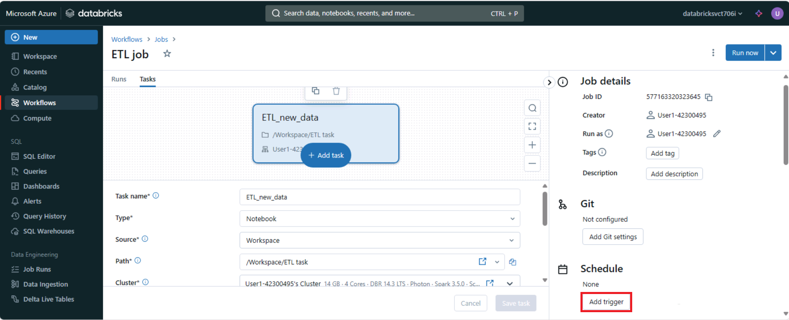

---
lab:
  title: 使用 Azure Databricks Workflows 部署工作负载
---

# 使用 Azure Databricks Workflows 部署工作负载

Azure Databricks Workflows 提供了一个可靠的平台，用于高效部署工作负荷。 借助 Azure Databricks Jobs 和 Delta Live Tables 等功能，用户可以协调复杂的数据处理、机器学习和分析管道。

完成本实验室大约需要 40 分钟。

## 预配 Azure Databricks 工作区

> **提示**：如果你已有 Azure Databricks 工作区，则可以跳过此过程并使用现有工作区。

本练习包括一个用于预配新 Azure Databricks 工作区的脚本。 该脚本会尝试在一个区域中创建*高级*层 Azure Databricks 工作区资源，在该区域中，Azure 订阅具有本练习所需计算核心的充足配额；该脚本假设你的用户帐户在订阅中具有足够的权限来创建 Azure Databricks 工作区资源。 如果脚本由于配额或权限不足失败，可以尝试 [在 Azure 门户中以交互方式创建 Azure Databricks 工作区](https://learn.microsoft.com/azure/databricks/getting-started/#--create-an-azure-databricks-workspace)。

1. 在 Web 浏览器中，登录到 [Azure 门户](https://portal.azure.com)，网址为 `https://portal.azure.com`。

2. 使用页面顶部搜索栏右侧的 [\>_] 按钮在 Azure 门户中创建新的 Cloud Shell，在出现提示时选择“PowerShell”环境并创建存储。 Cloud Shell 在 Azure 门户底部的窗格中提供命令行界面，如下所示：

    

    > **注意**：如果以前创建了使用 Bash 环境的 Cloud Shell，请使用 Cloud Shell 窗格左上角的下拉菜单将其更改为 PowerShell********。

3. 请注意，可以通过拖动窗格顶部的分隔条或使用窗格右上角的 &#8212;、&#9723; 或 X 图标来调整 Cloud Shell 的大小，以最小化、最大化和关闭窗格  。 有关如何使用 Azure Cloud Shell 的详细信息，请参阅 [Azure Cloud Shell 文档](https://docs.microsoft.com/azure/cloud-shell/overview)。

4. 在 PowerShell 窗格中，输入以下命令以克隆此存储库：

     ```powershell
    rm -r mslearn-databricks -f
    git clone https://github.com/MicrosoftLearning/mslearn-databricks
     ```

5. 克隆存储库后，请输入以下命令以运行 **setup.ps1** 脚本，以在可用区域中预配 Azure Databricks 工作区：

     ```powershell
    ./mslearn-databricks/setup.ps1
     ```

6. 如果出现提示，请选择要使用的订阅（仅当有权访问多个 Azure 订阅时才会发生这种情况）。

7. 等待脚本完成 - 这通常需要大约 5 分钟，但在某些情况下可能需要更长的时间。 在等待时，请查看 Azure Databricks 文档中的 [Delta Lake 简介](https://docs.microsoft.com/azure/databricks/delta/delta-intro)一文。

## 创建群集

Azure Databricks 是一个分布式处理平台，可使用 Apache Spark 群集在多个节点上并行处理数据。 每个群集由一个用于协调工作的驱动程序节点和多个用于执行处理任务的工作器节点组成。 在本练习中，将创建一个*单节点*群集，以最大程度地减少实验室环境中使用的计算资源（在实验室环境中，资源可能会受到限制）。 在生产环境中，通常会创建具有多个工作器节点的群集。

> **提示**：如果 Azure Databricks 工作区中已有一个具有 13.3 LTS ML 或更高运行时版本的群集，则可以使用它来完成此练习并跳过此过程。

1. 在 Azure 门户中，浏览到已由脚本创建的 **msl-xxxxxxx*** 资源组（或包含现有 Azure Databricks 工作区的资源组）

1. 选择 Azure Databricks 服务资源（如果已使用安装脚本创建，则名为 **databricks-xxxxxxx***）。

1. 在工作区的“概述”**** 页中，使用“启动工作区”**** 按钮在新的浏览器标签页中打开 Azure Databricks 工作区；请在出现提示时登录。

    > 提示：使用 Databricks 工作区门户时，可能会显示各种提示和通知。 消除这些内容，并按照提供的说明完成本练习中的任务。

1. 在左侧边栏中，选择“**(+) 新建**”任务，然后选择“**群集**”。

1. 在“新建群集”页中，使用以下设置创建新群集：
    - 群集名称：用户名的群集（默认群集名称）
    - **策略**：非受限
    - 群集模式：单节点
    - 访问模式：单用户（选择你的用户帐户）
    - **Databricks 运行时版本**：13.3 LTS（Spark 3.4.1、Scala 2.12）或更高版本
    - 使用 Photon 加速：已选择
    - **节点类型**：Standard_D4ds_v5
    - 在处于不活动状态 20 分钟后终止**********

1. 等待群集创建完成。 这可能需要一到两分钟时间。

    > 注意：如果群集无法启动，则订阅在预配 Azure Databricks 工作区的区域中的配额可能不足。 请参阅 [CPU 内核限制阻止创建群集](https://docs.microsoft.com/azure/databricks/kb/clusters/azure-core-limit)，了解详细信息。 如果发生这种情况，可以尝试删除工作区，并在其他区域创建新工作区。 可以将区域指定为设置脚本的参数，如下所示：`./mslearn-databricks/setup.ps1 eastus`
        
## 创建笔记本并引入数据

1. 在边栏中，使用“(+) 新建”**** 链接创建**笔记本**。

2. 在“连接”**** 下拉列表中，选择群集（如果尚未选择）。 如果群集未运行，可能需要一分钟左右才能启动。

3. 在笔记本的第一个单元格中输入以下代码，该代码使用 *shell* 命令将数据文件从 GitHub 下载到群集使用的文件系统中。

     ```python
    %sh
    rm -r /dbfs/workflow_lab
    mkdir /dbfs/workflow_lab
    wget -O /dbfs/workflow_lab/2019.csv https://github.com/MicrosoftLearning/mslearn-databricks/raw/main/data/2019_edited.csv
    wget -O /dbfs/workflow_lab/2020.csv https://github.com/MicrosoftLearning/mslearn-databricks/raw/main/data/2020_edited.csv
    wget -O /dbfs/workflow_lab/2021.csv https://github.com/MicrosoftLearning/mslearn-databricks/raw/main/data/2021_edited.csv
     ```

4. 使用单元格左侧的“&#9656; 运行单元格”菜单选项来运行该代码****。 然后等待代码运行的 Spark 作业完成。

## 创建作业任务

可以使用任务来实现数据处理和分析工作流。 一个作业由一个或多个任务组成。 可以创建运行笔记本、JARS、增量实时表管道或者 Python、Scala、Spark 提交和 Java 应用程序的作业任务。 在本练习中，你将以笔记本的形式创建一个任务，用于提取和转换数据，并将数据加载到可视化图表中。 

1. 在边栏中，使用“(+) 新建”**** 链接创建**笔记本**。

2. 将默认笔记本名称 (**Untitled Notebook *[date]***) 更改为 `ETL task`，然后在“**连接**”下拉列表中选择群集（如果尚未选择）。 如果群集未运行，可能需要一分钟左右才能启动。

3. 在笔记本的第一个单元中，输入以下代码，该代码定义数据的架构并在数据帧中加载数据集：

    ```python
   from pyspark.sql.types import *
   from pyspark.sql.functions import *
   orderSchema = StructType([
        StructField("SalesOrderNumber", StringType()),
        StructField("SalesOrderLineNumber", IntegerType()),
        StructField("OrderDate", DateType()),
        StructField("CustomerName", StringType()),
        StructField("Email", StringType()),
        StructField("Item", StringType()),
        StructField("Quantity", IntegerType()),
        StructField("UnitPrice", FloatType()),
        StructField("Tax", FloatType())
   ])
   df = spark.read.load('/workflow_lab/*.csv', format='csv', schema=orderSchema)
   display(df.limit(100))
    ```

4. 在现有代码单元格下，使用 + 图标添加新的代码单元格****。 然后在新单元格中，输入并运行以下代码，以删除重复行并将 `null` 条目替换为正确的值：

     ```python
    from pyspark.sql.functions import col
    df = df.dropDuplicates()
    df = df.withColumn('Tax', col('UnitPrice') * 0.08)
    df = df.withColumn('Tax', col('Tax').cast("float"))
     ```
    > **备注**：更新“**税款**”列中的值后，其数据类型将再次设置为 `float`。 这是因为其数据类型在执行计算后更改为 `double`。 由于 `double` 内存使用量高于 `float`，因此为了提高性能，最好将列类型转换回 `float`。

5. 在新代码单元格中，运行以下代码以聚合和分组订单数据：

    ```python
   yearlySales = df.select(year("OrderDate").alias("Year")).groupBy("Year").count().orderBy("Year")
   display(yearlySales)
    ```

6. 在结果表上方，选择 +，然后选择“可视化效果”以查看可视化效果编辑器，然后应用以下选项********：

   **常规**选项卡：
    - **可视化效果类型**：条形图
    - **X 列**：年份
    - **Y 列**：添加新列并选择**“计数”****。 *应用* **Sum** *聚合*。
   
   X 轴**** 选项卡：
    - **量表**：分类

8. 选择“保存”。

## 生成工作流

Azure Databricks 可管理所有作业的任务业务流程、群集管理、监视和错误报告。 你可以立即运行作业，通过易于使用的调度系统定期运行，只要新文件到达外部位置就可以这样做；也可以连续运行以确保作业实例始终处于运行状态。

1. 在左侧边栏中，选择“工作流”****。

2. 在“工作流”窗格中，选择“创建作业”****。

3. 将默认作业名称 (**New job *[date]***) 更改为 `ETL job`。

4. 在“任务名称”**** 字段中输入任务的名称。

5. 在“类型”下拉菜单中选择“笔记本”********。

6. 在“路径”**** 字段中，选择“ETL 任务”**** 笔记本。

7. 选择“创建任务”****。

8. 选择“立即运行”。

9. 作业开始运行后，可以通过在左侧栏中选择“作业运行”**** 来监控其执行情况。

10. 作业运行成功后，可以选择它并验证其输出。

此外，可以基于触发运行作业，例如，按计划运行工作流。 若要安排定期作业运行，可以打开作业任务，然后在右侧面板中选择**添加触发器**。

   
    
## 清理

在 Azure Databricks 门户的“计算”**** 页上，选择群集，然后选择“&#9632; 停止”****，以将其关闭。

如果已完成对 Azure Databricks 的探索，则可以删除已创建的资源，以避免产生不必要的 Azure 成本并释放订阅中的容量。
